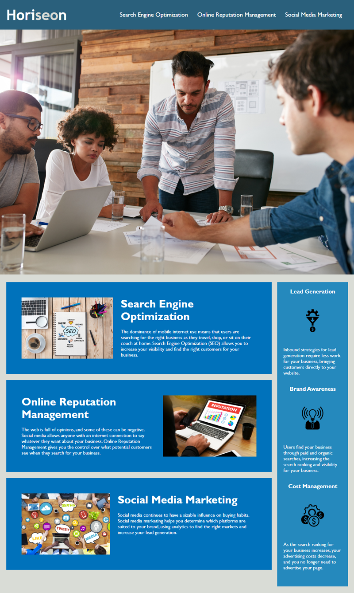

# **Horiseon: Increase Site Accessibility**

## Project Description:
I was asked to make changes to the codebase of a web application for Horiseon, a digital marketing agency. 

For this project, I was given the [starter code](https://github.com/coding-boot-camp/urban-octo-telegram) through a link to a remote repository on github. I cloned the starter code to my local machine, and then I created a unique, remote repository with the given starter code. 

I then refactored the code in order to increase the site's accessibility in accordance with the given user story and acceptance criteria. While refactoring the code, and making sure all links worked and images displayed properly, I also made the CSS stylesheet more efficient by consolidating CSS selectors and properties. I went on to organize the CSS stylesheet to follow the semantic structure of the HTML, adding comments before each element or section in the stylesheet for added clarity. 

This project helped me become more familiar with the relationship between HTML and CSS, and how to best structure each of them for optimum site accessibility. 

## Table of Contents:
#### [User Story](#User-Story)
#### [Acceptance Criteria](#Acceptance-Criteria)
#### [Assets](#Assets)
#### [Reflections](#Reflections)
#### [Helpful Resources](#Helpful-Resources)


## User Story:
As a marketing agency
I WANT a codebase that follows accessibility standards
SO THAT our own site is optimized for search engines 

## Acceptance Criteria: 

#### WHEN I view the source code
#### *THEN I find semantic HTML elements*
#### WHEN I view the structure of the HTML elements 
#### *THEN I find that the elements follow a logical structure independent of styling and positioning*
#### WHEN I view the image elements 
#### *THEN I find accessible alt attributes*
#### WHEN I view the heading attributes
#### *THEN they fall in sequential order*
#### WHEN I view the title element 
#### *THEN I find a concise, descriptive title*

## Assets:
The following image, provided in the [starter code](https://github.com/coding-boot-camp/urban-octo-telegram), demonstrates the expected appearance of the web application, helping me gauge if the web application is displaying properly:



## Reflections:
After setting up my unique, remote repository and connecting it to my local machine, I found that I prefer to work in small, incremental commits. Rather than making multiple pushes to the remote repository, I would make a specific change locally and commit that change with a descriptive message, but not push it, as I knew I was going to be making additional changes to the code. This helped me resolve the bugs and refactor that code in manageable steps that I could undo easily by making another commit. After completing a change locally, I would typically `git status` to check that there were unstaged commits. Then I would use these commands to stage and commit:
```
git add .
git commit -m "past-tense description of what change I made with this commit"
```
Working this way made it easier for me to follow my own progress. I would also use the command `git log` to remind myself of previous commits. 


## Helpful Resources:
Aside from the [starter code](https://github.com/coding-boot-camp/urban-octo-telegram), the following resources helped me complete the necessary steps to begin this project:
### [Getting started with Git](https://coding-boot-camp.github.io/full-stack/git/getting-started-with-git)
### [Best Practices for README.md](https://coding-boot-camp.github.io/full-stack/github/professional-readme-guide)

To successfully refactor the code and make Horiseon's site more accessible, I referred to the following resources:
### [HTML Tutorial](https://www.w3schools.com/html/?tag=search%20engine%20optimization)
### [HTML Structure](https://www.freecodecamp.org/news/html-best-practices/#:~:text=It%20is%20best%20practice%20to,and%20elements%20instead)
### [Organizing CSS](https://developer.mozilla.org/en-US/docs/Learn/CSS/Building_blocks/Organizing)
### [CSS Tutorial](https://www.w3schools.com/csS/default.asp)
### [Styling Text in CSS](https://developer.mozilla.org/en-US/docs/Learn/CSS/Styling_text/Fundamentals)
### [This forum helped me figure out how to fix a hyperlink within the application](https://stackoverflow.com/questions/2835140/how-do-i-link-to-part-of-a-page-hash)

